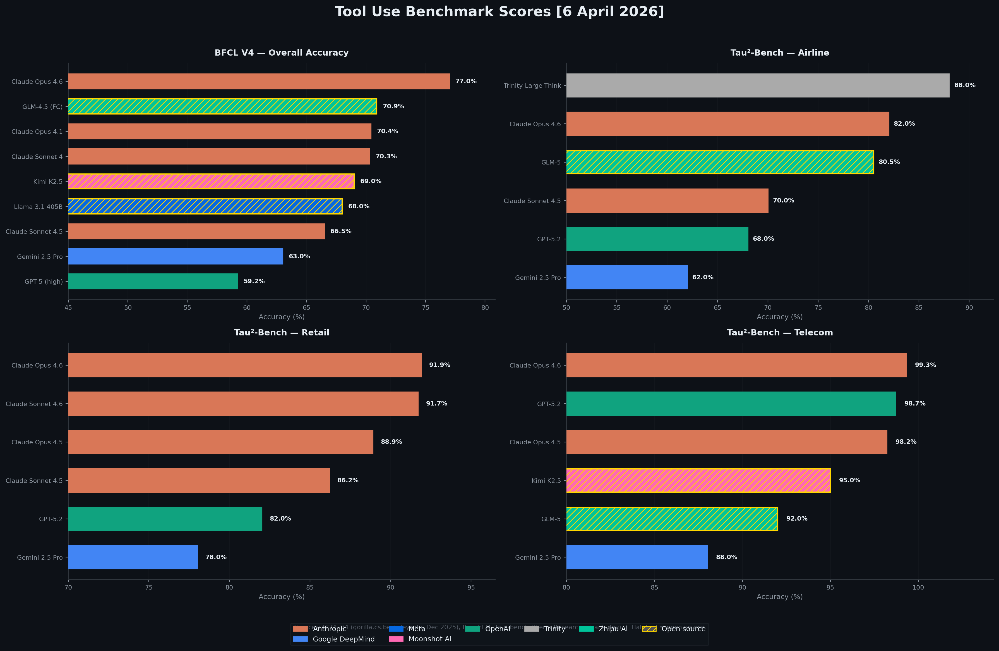

# SOTA Reference

Research articles on state-of-the-art topics in AI and software engineering.

## Articles

- [Frontier AI Models Benchmark](frontier-models-benchmark.md) — Rankings across overall performance, agentic coding, tool use, vision, audio, voice, open source, small models, and throughput
- [RAG & Context Engineering](rag-and-context-engineering.md) — Retrieval-augmented generation patterns, chunking strategies, and managed services
- [Embedding Models](embedding-models.md) — Best open-source local embedding models and how they compare with proprietary alternatives
- [Research Agent Frameworks](frameworks-research-agents.md) — Frameworks for building autonomous research agents
- [Chatbot Evaluation: LLM-as-a-Judge](chatbot-evaluation-llm-as-judge.md) — Modern methods and best practices for evaluating chatbots using LLMs as judges
- [Benchmarks for RAG Chatbots](rag-chatbot-benchmarks.md) — Benchmarks for testing RAG-powered chatbots
- [Large Document LLM Methods](large-document-llm-methods.md) — Methods for processing large documents with LLM-based chatbots
- [Preventing Topic Hijacking](chatbot-topic-hijacking-prevention.md) — Preventing topic hijacking and prompt injection in domain-specific chatbots
- [Embedding Pre-Screening for Topic Relevance](embedding-pre-screening-chatbot-topic-relevance.md) — Embedding-based pre-screening for chatbot topic relevance

## Model Elo Timeline

LMArena (Chatbot Arena) Elo ratings for frontier AI models over time, coloured by lab with family lines connecting models of the same class.

### Last 6 Months


### Last 2 Years


## Tool Use Benchmarks

Scores across BFCL V4 (structured function calling) and Tau²-bench domains (airline, retail, telecom agent tool use).



## Regenerate Charts

```bash
python3 .scripts/plot_model_elo.py
python3 .scripts/plot_tool_use.py
```
