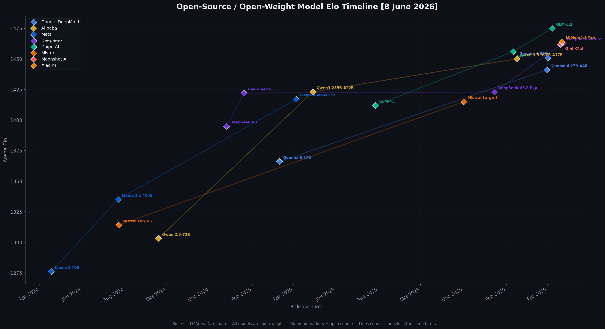
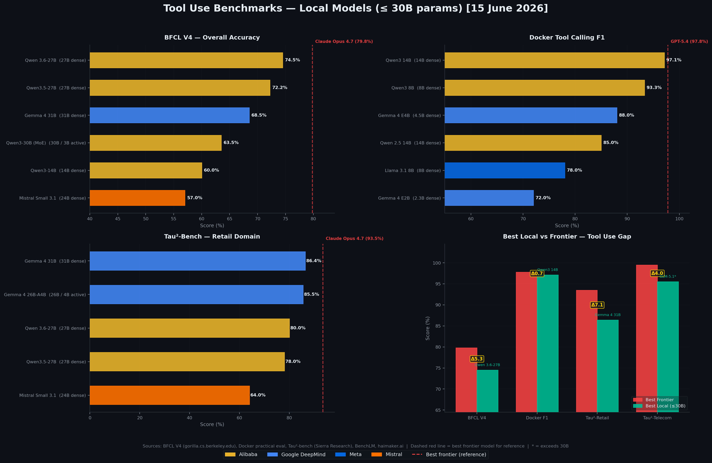

# SOTA Reference

Research articles on state-of-the-art topics in AI and software engineering.

## Articles

- [Frontier AI Models Benchmark](frontier-models-benchmark.md) — Rankings across overall performance, agentic coding, tool use, vision, audio, voice, open source, small models, and throughput
- [RAG & Context Engineering](rag-and-context-engineering.md) — Retrieval-augmented generation patterns, chunking strategies, and managed services
- [Embedding Models](embedding-models.md) — Best open-source local embedding models and how they compare with proprietary alternatives
- [Research Agent Frameworks](frameworks-research-agents.md) — Frameworks for building autonomous research agents
- [Chatbot Evaluation: LLM-as-a-Judge](chatbot-evaluation-llm-as-judge.md) — Modern methods and best practices for evaluating chatbots using LLMs as judges
- [Benchmarks for RAG Chatbots](rag-chatbot-benchmarks.md) — Benchmarks for testing RAG-powered chatbots
- [Large Document LLM Methods](large-document-llm-methods.md) — Methods for processing large documents with LLM-based chatbots
- [Preventing Topic Hijacking](chatbot-topic-hijacking-prevention.md) — Preventing topic hijacking and prompt injection in domain-specific chatbots
- [Embedding Pre-Screening for Topic Relevance](embedding-pre-screening-chatbot-topic-relevance.md) — Embedding-based pre-screening for chatbot topic relevance
- [Agentic Coding: Claude Code vs OpenAI Codex](agentic-coding-claude-vs-openai.md) — Best-in-class models, benchmark comparison, architecture differences, and consistency analysis for Claude Code and OpenAI Codex
- [Current Best Frontier LLMs](current-best-frontier-llms.md) — Quick-reference list of the best models from Anthropic, OpenAI, and Google as of May 2026
- [Local Multimodal Vision-Language Models](local-multimodal-vision-language-models.md) — Open-source VLMs for image identification, interpretation, and detailed description running on local hardware
- [Prompting Best Practices](dev-best-practices/prompting.md) — Prompting techniques, prompt storage patterns, CI/CD testing, and multi-cloud management for professional services
- [Azure AI Development Best Practices](dev-best-practices/azure-ai-development.md) — Platform architecture, RAG, agents, security, cost management, and evaluation for building AI systems on Azure in 2026
- [AWS AI Development Best Practices](dev-best-practices/aws-ai-development.md) — Bedrock platform, RAG (Knowledge Bases + S3 Vectors), AgentCore, Guardrails, cost management, and evaluation for building AI systems on AWS in 2026
- [GCP AI Development Best Practices](dev-best-practices/gcp-ai-development.md) — Gemini Enterprise Agent Platform, ADK, Agent Runtime, RAG Engine / search / AlloyDB AI, security, cost management, and evaluation for building AI systems on Google Cloud in 2026
- [Modern AI Observability](ai-observability.md) — LLM observability concepts, OpenTelemetry GenAI conventions, agentic/swarm tracing, open-source tools, and hyperscaler services
- [DAG Workflows](dev-best-practices/dag-workflows.md) — DAG orchestration tools (Airflow, Prefect, Dagster, Temporal, Flyte, Argo, Kestra), design patterns, anti-patterns, testing, lineage, and managed services
- [Real-Time Voice LLMs](real-time-voice-llms.md) — Voice-to-voice models for assistants: architectures, local vs cloud deployment, latency, expressiveness, tool use, and open-source options
- [Best Local LLMs for Consumer Hardware](local-llms-consumer-hardware.md) — Open-source models (Gemma 4, Qwen 3.5/3.6, Llama 4, Phi-4, Mistral) for local inference on GPUs and Apple Silicon with benchmarks, VRAM tiers, quantisation, and framework comparison
- [Open Models for Coding Agents](open-models-coding-agents.md) — Best open models for coding agents vs frontier closed models across SWE-bench, Aider, LiveCodeBench, and Terminal-Bench, with consumer-hardware and large-model tiers

## Reference designs

- [RAG Knowledge Base for Mixed Document Sizes](reference-designs/rag-knowledge-base-mixed-document-sizes.md) — Production RAG pipeline for collections spanning 1- to 600-page documents (hybrid retrieval + RRF + reranking on pgvector)
- [Edge-First AI Clinical Documentation](reference-designs/edge-first-clinical-documentation.md) — Edge-compute AI processing for clinical documentation in disconnected environments with clinician-in-the-loop approval and EHR integration
- [Copilot MCP Integration (Azure)](reference-designs/copilot-mcp-integration-azure.md) — Microsoft 365 Copilot enterprise backend integration via Azure AI Foundry, MCP servers, and API Management with OBO/ACL/gateway patterns
- [Conversational AI with Tiered Semantic Routing](reference-designs/conversational-ai-semantic-routing.md) — Tiered routing architecture that bypasses the full agentic planner for high-confidence single-intent requests using embedding similarity and slot guards
- [RAG Compliance Assistant (Small-Scale Azure)](reference-designs/rag-compliance-assistant-azure.md) — Serverless RAG architecture for 100-500 document compliance/advisory Q&A with cited copy-pasteable answers and DeepEval CI/CD quality gates
- [AI-Assisted OIA/FOI Processing Pipeline](reference-designs/oia-foi-processing-pipeline.md) — Eight-stage AI-assisted pipeline for Official Information Act and Freedom of Information request processing with mandatory human-in-the-loop at every decision point
- [Automated Multi-Step AI Research Pipeline](reference-designs/ai-investment-research-pipeline.md) — Workflow engine for chaining LLM calls across structured analytical processes with state management, context budgeting, and human checkpoints
- [AI-Assisted Change Impact Assessment for Mega-Projects](reference-designs/ai-change-impact-assessment-megaproject.md) — Agentic AI for assessing change request impacts against regulatory and compliance document baselines on $1B+ infrastructure projects

## Model Elo Timeline

LMArena (Chatbot Arena) Elo ratings for frontier AI models over time, coloured by lab with family lines connecting models of the same class.

### Last 6 Months

### Last 2 Years

## Open-Source Model Elo Timeline

LMArena Elo ratings for open-weight models over time, showing the progression of each model family.

## Tool Use Benchmarks

Scores across BFCL V4 (structured function calling) and Tau²-bench domains (airline, retail, telecom agent tool use).

### Local Models (≤ 30B params)

Tool use performance for models that can run locally, with frontier model reference lines. Covers BFCL V4, Docker's practical tool calling eval, and Tau²-bench Retail.

