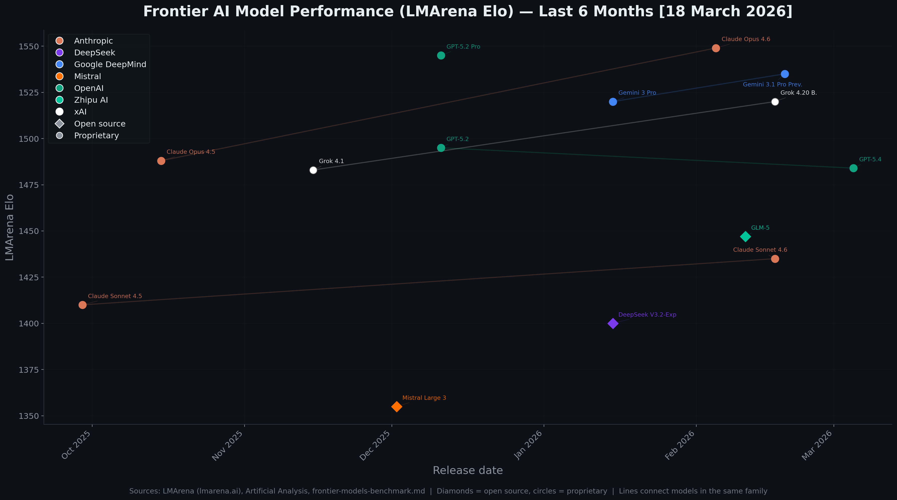
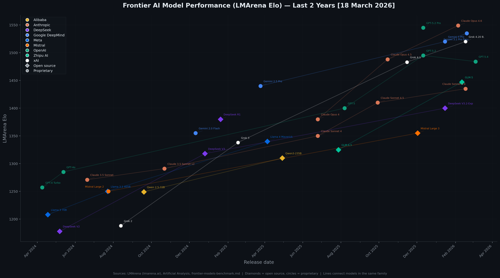

# SOTA Reference

Research articles on state-of-the-art topics in AI and software engineering.

## Articles

- [Frontier AI Models Benchmark](frontier-models-benchmark.md) - Rankings across overall performance, agentic coding, tool use, vision, audio, voice, open source, small models, and throughput
- [RAG & Context Engineering](rag-and-context-engineering.md) - Retrieval-augmented generation patterns, chunking strategies, and managed services
- [Research Agent Frameworks](frameworks-research-agents.md) - Frameworks for building autonomous research agents

## Model Elo Timeline

LMArena (Chatbot Arena) Elo ratings for frontier AI models over time, coloured by lab with family lines connecting models of the same class.

### Last 6 Months

### Last 2 Years

Regenerate charts: `python3 .scripts/plot_model_elo.py`
