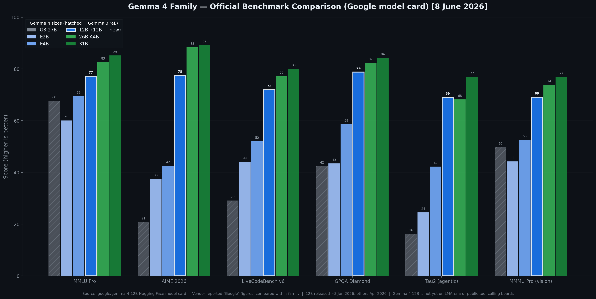

# Gemma 4 12B: Capabilities and Benchmark Overview

| Field | Value |
|-------|-------|
| Created | 2026-06-05 |
| Last Updated | 2026-06-08 |
| Version | 1.1 |

---

## Table of contents

- [At a glance](#at-a-glance)
- [Executive summary](#executive-summary)
- [The Gemma 4 family](#the-gemma-4-family)
- [Architecture](#architecture)
- [Architecture specs across the family](#architecture-specs-across-the-family)
- [Benchmark performance: full family comparison](#benchmark-performance-full-family-comparison)
- [How 12B stacks up against its siblings](#how-12b-stacks-up-against-its-siblings)
- [Audio: the mid-sized differentiator](#audio-the-mid-sized-differentiator)
- [Deployment and how to run](#deployment-and-how-to-run)
- [Managed service options](#managed-service-options)
- [Limitations and caveats](#limitations-and-caveats)
- [Bottom line and recommendations](#bottom-line-and-recommendations)
- [References](#references)

---

## At a glance

**Gemma 4 12B** is the newest member of Google DeepMind's open-weights **Gemma 4** family, released **~3 June 2026** — roughly two months after the original Gemma 4 launch (E2B, E4B, 26B A4B MoE, 31B Dense in April 2026). It is positioned to **bridge the gap between the edge-friendly E4B and the larger 26B Mixture-of-Experts (MoE)**, and it is Google's **first mid-sized Gemma model with native audio input**.

| Property | Value |
|----------|-------|
| Developer | Google DeepMind |
| Released | ~3 June 2026 |
| Total parameters | 11.95B (dense) |
| Layers | 48 |
| Context window | 256K tokens |
| Modalities | Text, Image, Audio (native, encoder-free) |
| Architecture | Unified, encoder-free transformer |
| Memory to run | ~16 GB VRAM / unified memory |
| Licence | Apache 2.0 |
| Notable extras | Multi-Token Prediction (MTP) drafters for low-latency speculative decoding |

---

## Executive summary

Gemma 4 12B is the **"sweet spot" laptop model** of the Gemma 4 family. Google's headline claim is that it delivers *"performance nearing our larger 26B MoE model on standard benchmarks, but at less than half the total memory footprint."* The official benchmark numbers (published on the Hugging Face model card) bear this out for agentic, coding, long-context and multilingual tasks, where 12B is within a few points of — and occasionally ahead of — the 26B A4B MoE. The 26B and 31B retain a clear edge only on the hardest competition-math and frontier reasoning benchmarks.

Two things make 12B distinctive within the family:

1. **It is the only model above the E-series with native audio.** The larger 26B A4B and 31B Dense are text + image only. For automatic speech recognition (ASR) or speech translation, 12B is the most capable Gemma 4 model available.
2. **It fits in 16 GB** of VRAM or unified memory, making it the largest Gemma 4 that runs comfortably on a typical consumer/enterprise laptop.

It comprehensively outclasses the previous-generation Gemma 3 27B despite being less than half the size.

---

## The Gemma 4 family

Gemma 4 launched in **April 2026** under Apache 2.0 with four sizes; the **12B was added in June 2026** as a mid-sized fifth member. As of the 12B launch, the family had crossed **150 million downloads**.

| Model | Type | Total params | Active params | Audio | Niche |
|-------|------|--------------|---------------|:-----:|-------|
| E2B | Dense (edge) | 2.3B effective (5.1B w/ embeddings) | — | ✅ | Phones, ultra-light edge |
| E4B | Dense (edge) | 4.5B effective (8B w/ embeddings) | — | ✅ | Capable edge / small GPU |
| **12B Unified** | **Dense** | **11.95B** | **—** | **✅** | **16 GB laptop sweet spot** |
| 26B A4B | MoE | 25.2B | 3.8B | ❌ | High quality at ~12B-class speed |
| 31B Dense | Dense | 30.7B | — | ❌ | Flagship / maximum quality |

The "E" models (E2B, E4B) are the edge-optimised line with 128K context. The 12B, 26B and 31B form the medium tier with 256K context. Note that **only the E2B, E4B and 12B support audio** — the 26B and 31B are text + image only.

---

## Architecture

Gemma 4 12B uses a **unified, encoder-free architecture**. Where traditional multimodal models bolt on separate vision and audio encoders that translate inputs before passing them to the language model, Gemma 4 12B feeds image and raw audio signals **directly into the LLM backbone**, removing the latency and memory overhead of those encoders.

- **Vision**: the vision encoder is replaced by a lightweight embedding module — a single matrix multiplication plus positional embedding and normalisations. The LLM backbone takes over visual processing itself. (The 12B and 31B report no separate vision-encoder parameter count; the E-series carries a ~150M vision module and the 26B/31B a ~550M one in the spec table — the 12B's vision path is folded into the backbone.)
- **Audio**: the audio encoder is removed entirely; the raw audio signal is projected into the same dimensional space as text tokens.
- **Speculative decoding**: 12B ships with **Multi-Token Prediction (MTP) drafters** built in, reducing latency out of the box.
- **Thinking mode**: like the rest of the medium tier, 12B supports a controllable thinking/reasoning mode via control tokens (the E2B/E4B edge models behave differently — they do not emit empty thought blocks when thinking is disabled).

---

## Architecture specs across the family

| Property | E2B | E4B | **12B Unified** | 26B A4B MoE | 31B Dense |
|----------|-----|-----|-----------------|-------------|-----------|
| Total params | 2.3B eff. (5.1B w/ emb.) | 4.5B eff. (8B w/ emb.) | **11.95B** | 25.2B | 30.7B |
| Active params | — | — | **—** | 3.8B | — |
| Layers | 35 | 42 | **48** | 30 | 60 |
| Sliding window | 512 | 512 | **1024** | 1024 | 1024 |
| Context length | 128K | 128K | **256K** | 256K | 256K |
| Vocabulary | 262K | 262K | **262K** | 262K | 262K |
| Modalities | Text, Image, Audio | Text, Image, Audio | **Text, Image, Audio** | Text, Image | Text, Image |
| Vision encoder params | ~150M | ~150M | **—** | ~550M | ~550M |
| Audio encoder params | ~300M | ~300M | **—** | No audio | No audio |
| Expert count | — | — | **—** | 8 active / 128 total + 1 shared | — |

---

## Benchmark performance: full family comparison

These are the **official numbers from the Hugging Face model card** (`google/gemma-4-12B`). Gemma 3 27B (no-think) is included as Google's previous-generation reference point. Higher is better unless marked ↓.

| Benchmark | 31B Dense | 26B A4B | **12B Unified** | E4B | E2B | Gemma 3 27B |
|-----------|:---------:|:-------:|:---------------:|:---:|:---:|:-----------:|
| **MMLU Pro** | 85.2 | 82.6 | **77.2** | 69.4 | 60.0 | 67.6 |
| **AIME 2026** (no tools) | 89.2 | 88.3 | **77.5** | 42.5 | 37.5 | 20.8 |
| **LiveCodeBench v6** | 80.0 | 77.1 | **72.0** | 52.0 | 44.0 | 29.1 |
| **Codeforces ELO** | 2150 | 1718 | **1659** | 940 | 633 | 110 |
| **GPQA Diamond** | 84.3 | 82.3 | **78.8** | 58.6 | 43.4 | 42.4 |
| **Tau2** (agentic, avg/3) | 76.9 | 68.2 | **69.0** | 42.2 | 24.5 | 16.2 |
| **HLE** (no tools) | 19.5 | 8.7 | **5.2** | – | – | – |
| **HLE** (with search) | 26.5 | 17.2 | **–** | – | – | – |
| **BigBench Extra Hard** | 74.4 | 64.8 | **53.0** | 33.1 | 21.9 | 19.3 |
| **MMMLU** (multilingual) | 88.4 | 86.3 | **83.4** | 76.6 | 67.4 | 70.7 |
| **MMMU Pro** (vision) | 76.9 | 73.8 | **69.1** | 52.6 | 44.2 | 49.7 |
| **MATH-Vision** | 85.6 | 82.4 | **79.7** | 59.5 | 52.4 | 46.0 |
| **MedXPertQA MM** | 61.3 | 58.1 | **48.7** | 28.7 | 23.5 | – |
| **OmniDocBench 1.5** (edit dist ↓) | 0.131 | 0.149 | **0.164** | 0.181 | 0.290 | 0.365 |
| **MRCR v2** (128K long-ctx) | 66.4 | 44.1 | **43.4** | 25.4 | 19.1 | 13.5 |
| **CoVoST** (audio) | – | – | **38.5** | 35.5 | 33.5 | – |
| **FLEURS** (audio ↓) | – | – | **0.069** | 0.08 | 0.09 | – |

\* Audio figures for 12B are reported with an asterisk on the source card, indicating a preliminary/checkpoint measurement.

---

## How 12B stacks up against its siblings

**vs E4B (the model directly below it):** 12B is a generational jump in reasoning and coding — roughly **+35 points on AIME** (77.5 vs 42.5), **+20 on GPQA** (78.8 vs 58.6), **+20 on LiveCodeBench** (72 vs 52), and a Codeforces ELO of 1659 vs 940 — for ~2.6× the effective parameters. If you have the memory for 12B, there is little reason to choose E4B except on the tightest hardware.

**vs 26B A4B MoE (the model Google benchmarks it against):** This is the headline story. 12B lands **3–11 points behind** the 26B MoE on most benchmarks while using **less than half the memory**, and is **tied or ahead** on several:

- **Agentic (Tau2): 69.0 vs 68.2 — 12B slightly wins.**
- **Long context (MRCR 128K): 43.4 vs 44.1 — essentially tied.**
- **Codeforces ELO: 1659 vs 1718 — very close.**
- Larger gaps remain on hard reasoning: AIME (77.5 vs 88.3), BigBench Extra Hard (53.0 vs 64.8), MMLU Pro (77.2 vs 82.6), HLE (5.2 vs 8.7).
- Plus 12B **has native audio that the 26B lacks entirely.**

Google's "nearing the 26B" claim is well-supported for agentic, coding, long-context and multilingual workloads; the 26B's advantage concentrates in frontier math and the hardest reasoning evals.

**vs 31B Dense (the flagship):** 31B leads everywhere, most starkly on the hardest evals — HLE (19.5 vs 5.2), long-context MRCR (66.4 vs 43.4), BigBench Extra Hard (74.4 vs 53.0). 12B is not built to compete here; it trades top-end reasoning for fitting in 16 GB.

**vs the previous generation (Gemma 3 27B):** 12B beats the older 27B decisively despite being less than half the size — AIME 77.5 vs 20.8, LiveCodeBench 72 vs 29, GPQA 78.8 vs 42.4, MMLU Pro 77.2 vs 67.6.

---

## Audio: the mid-sized differentiator

Gemma 4 12B is the **first mid-sized Gemma to feature native audio inputs**, joining only the E2B and E4B edge models in the family with this capability. Audio support covers:

- **Automatic speech recognition (ASR)** across multiple languages.
- **Speech-to-translated-text** translation.

On the reported audio benchmarks 12B is the strongest of the audio-capable trio — **CoVoST 38.5** (vs E4B 35.5, E2B 33.5) and **FLEURS 0.069** word/character error (vs 0.08 / 0.09; lower is better). Because the 26B and 31B carry no audio path at all, **12B is the most capable Gemma 4 model for any voice or transcription workload.** Google demonstrated it transcribing, formatting and translating voice inputs fully offline in the Google AI Edge "Eloquent" app.

---

## Deployment and how to run

Gemma 4 12B is **open-weights under Apache 2.0**, with pre-trained and instruction-tuned (`-it`) checkpoints on Hugging Face and Kaggle. It runs in **~16 GB of VRAM or unified memory** (quantised), placing it within reach of a typical 16 GB laptop or a single mid-range GPU.

**Open-source runtimes and tooling:**

- **Local apps / one-click**: LM Studio, Ollama, Google AI Edge Gallery app, Google AI Edge Eloquent app, LiteRT-LM CLI.
- **Inference libraries**: Hugging Face Transformers, `llama.cpp`, MLX (Apple Silicon), SGLang, vLLM.
- **Fine-tuning**: Unsloth (memory-efficient LoRA/QLoRA).
- **Quantised weights**: GGUF builds (e.g. via Unsloth) for `llama.cpp`/Ollama.

The Transformers API exposes it as a multimodal image-text-to-text model (`AutoProcessor` + `AutoModelForImageTextToText` / `AutoModelForMultimodalLM`), with audio and video added to prompts by reference. Google also released an official **Gemma Skills repository** to help agents build with Gemma models.

> **Local-model note:** Per house guidance, the 12B is the recommended Gemma 4 size for a 16 GB machine; step down to E4B only if memory is tighter, and up to the 26B A4B MoE or 31B Dense if you have the VRAM and need the extra reasoning headroom. See also the repo's [Best Local LLMs for Consumer Hardware](local-llms-consumer-hardware.md) article.

---

## Managed service options

For teams that want Gemma 4 12B as a managed/hosted endpoint rather than self-hosting:

- **Google Cloud (GCP)** — first-party path. Deploy via the **Gemini Enterprise Agent Platform Model Garden**, **Cloud Run**, or **GKE** for production endpoints.
- **AWS** — Gemma open models are commonly self-hosted on **Amazon SageMaker** (or EC2 GPU instances) using the open weights; availability in Bedrock's managed catalogue varies by model and region, so SageMaker is the reliable route.
- **Azure** — self-host on **Azure Machine Learning** managed online endpoints / GPU VMs with the open weights.
- **Oracle (OCI)** and **IBM** — run on their GPU compute (OCI Data Science / IBM watsonx-adjacent GPU instances) via the open weights.

Because the weights are Apache 2.0, any hyperscaler with GPU compute can host the model directly; GCP is the only one with a first-party managed deployment path specifically called out by Google.

---

## Limitations and caveats

- **Frontier-reasoning gap**: 12B trails the 26B MoE and 31B Dense materially on the hardest math/reasoning evals (AIME, BigBench Extra Hard, HLE). It is a strong all-rounder, not a frontier reasoner.
- **Preliminary audio numbers**: the CoVoST/FLEURS figures for 12B carry an asterisk on the source card, signalling a checkpoint/preliminary measurement that may move.
- **Vendor-reported benchmarks**: all figures here are Google's own (Hugging Face card). They compare within the Gemma family and against Gemma 3; independent third-party head-to-heads against Qwen 3.5 / Llama 4 / DeepSeek were not verified under a common harness for this article.
- **Incomplete cells**: HLE "with search" and several audio/medical cells are blank for 12B, so some cross-model comparisons are partial.
- **Release recency**: launched ~3 June 2026; tooling, quantisations and ecosystem support were still settling at the time of writing.

---

## Bottom line and recommendations

Gemma 4 12B captures the bulk of the 26B MoE's quality — and matches it on agentic, long-context and coding tasks — at under half the memory, runs in 16 GB, and is the **only mid-to-large Gemma 4 with native audio**.

- **Choose 12B** when you need genuine reasoning/coding capability **locally on a 16 GB machine**, or any **on-device audio/ASR** task.
- **Choose E4B** only when memory is tighter than 16 GB.
- **Choose 26B A4B MoE or 31B Dense** when you need the top few points on hard math/reasoning, can afford the memory, and don't need audio.

---

## References

1. [Introducing Gemma 4 12B — The Keyword (blog.google)](https://blog.google/innovation-and-ai/technology/developers-tools/introducing-gemma-4-12B/) — official announcement: encoder-free unified architecture, "performance nearing our 26B MoE", 16 GB, Apache 2.0, MTP drafters, native audio, 150M downloads, deployment tooling.
2. [google/gemma-4-12B — Hugging Face model card](https://huggingface.co/google/gemma-4-12B) — official benchmark table and architecture spec tables for the full family.
3. [Google's new open-source Gemma 4 12B analyzes audio, video — VentureBeat](https://venturebeat.com/technology/googles-new-open-source-gemma-4-12b-analyzes-audio-video-and-runs-entirely-locally-on-a-typical-16gb-enterprise-laptop) — corroborates "nearing 26B MoE" and local 16 GB deployment.
4. [Google Gemma 4 12B Brings Multimodal AI to 16GB Laptops — TechTimes (4 Jun 2026)](https://www.techtimes.com/articles/317758/20260604/google-gemma-4-12b-brings-multimodal-ai-16gb-laptops-free-under-apache-20.htm) — release timing and positioning.
5. [Gemma 4 Complete Guide 2026 — codersera.com](https://codersera.com/blog/gemma-4-complete-guide-2026/) and [dev.to](https://dev.to/aniruddhaadak/gemma-4-complete-guide-2026-architecture-benchmarks-deployment-3en9) — confirm the April 2026 family (E2B / E4B / 26B A4B / 31B) into which 12B was later inserted.

