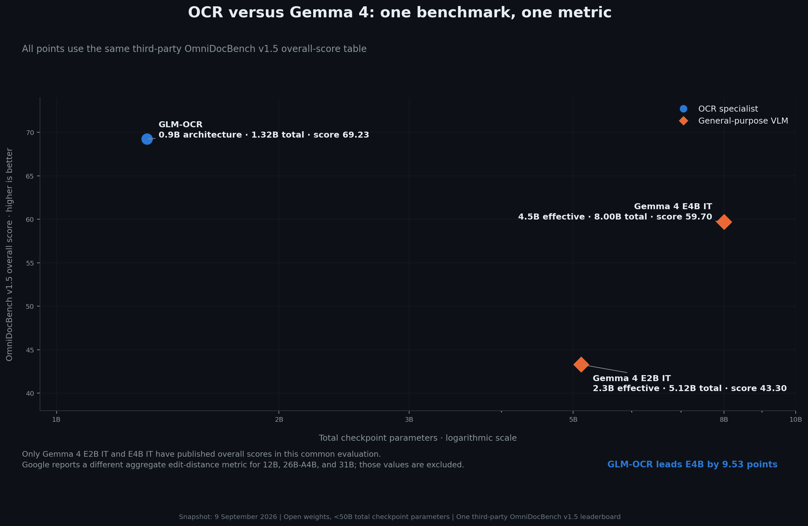

# OCR in 2026: Open Models, Handwritten PDFs, and Diacritics

| Field | Value |
|-------|-------|
| Created | 2026-06-02 |
| Last Updated | 2026-09-09 |
| Version | 2.0 |

---

- [Executive Summary](#executive-summary)
- [Decision Guide](#decision-guide)
- [Model Categories](#model-categories)
- [Best Open Models by Task](#best-open-models-by-task)
  - [Full-Page Document Parsing](#full-page-document-parsing)
  - [Printed and Scene Text](#printed-and-scene-text)
  - [Handwriting](#handwriting)
- [Handwritten PDFs](#handwritten-pdfs)
  - [Modern Handwriting](#modern-handwriting)
  - [Historical Handwriting](#historical-handwriting)
- [Names and Diacritics](#names-and-diacritics)
- [Recommended Production Pipeline](#recommended-production-pipeline)
- [Evaluation and Acceptance Tests](#evaluation-and-acceptance-tests)
- [Managed Services](#managed-services)
- [Risks and Limits](#risks-and-limits)
- [September 2026 Update](#september-2026-update)
- [References](#references)

---

## Executive Summary

As of 9 September 2026, there is no single best OCR model. The correct choice depends on whether the input is printed text, a complex page, modern handwriting, or historical handwriting.

- **Best open-weight page parser in the cited common comparison:** NaviDC-OCR. Its authors report 96.87 on OmniDocBench v1.6. OvisOCR2 follows at 96.58, and PaddleOCR-VL-1.6 follows at 96.33. These are full-page parsing results, not handwriting or name-accuracy results. [1][2][3]
- **Best open model in the new broad handwriting benchmark:** Qwen3-VL-8B led the aggregate result among 13 evaluated systems. Nanonets-OCR2-3B led the tested specialist OCR group. The ranking changes by language and formula type. [4]
- **Best fully open workflow for historical handwriting:** kraken with eScriptorium. It supports layout and line training, correction, and structured export. In the ICDAR 2026 multilingual medieval benchmark, adapted systems such as PERO and MEDUSA beat the generic kraken CATMuS baseline. [5][6][7]
- **Best lightweight printed and scene-text default:** PP-OCRv6. Its medium and small recognisers cover 50 languages in one model and include about 200 diacritical characters. However, PaddlePaddle's own test shows lower accuracy on handwriting than on print. [8][9]

For scanned handwritten PDFs that contain names with diacritics, use a **two-pass HTR pipeline with human review**. Do not use a page-parser score as proof of faithful name transcription. Preserve the page image and the raw output. Store a separate NFC-normalised value. Flag every disagreement in a name, every changed diacritic, and every low-confidence grapheme for review. Never remove accents or replace a name from an authority list without recording that change. [4][10][11]

> **Recommended starting stack:** OCRmyPDF for safe PDF preparation and searchable output; kraken/eScriptorium or pero-ocr for layout, line segmentation, and trainable HTR; Qwen3-VL-8B or a fine-tuned line recogniser as the primary transcription model; and PP-OCRv6 as an independent second pass. Add NaviDC-OCR when complex page structure, tables, or camera distortion are also important.

## Decision Guide

| Workload | Open-first recommendation | Why |
|---|---|---|
| Printed multilingual scans | PP-OCRv6; Tesseract as a deterministic second pass | Small, local, language-aware, and suitable for text boxes |
| Complex PDF pages | NaviDC-OCR; OvisOCR2 or PaddleOCR-VL-1.6 as alternatives | Best current open-weight page-parsing results in the cited common comparison |
| Modern handwritten pages | Qwen3-VL-8B plus a fine-tuned line recogniser | Best aggregate result in OmniHandwritingOCR, with a separate model to detect generative errors |
| Historical Latin-script manuscripts | kraken + eScriptorium or pero-ocr; MEDUSA for compatible medieval conventions | Trainable HTR and human correction are more important than zero-shot page parsing |
| Very long documents | Unlimited-OCR as an experimental option | Constant KV-cache design and multi-page generation |
| Fast GPU batch parsing | Jina-OCR-v1 after availability and licence checks | The paper reports 2.57 pages/s, but its weight link was unavailable when checked |
| Exact names with diacritics | Two independent recognisers plus review | One wrong grapheme can change identity; no current benchmark proves a universal winner |

## Model Categories

OCR now has four main categories. Do not compare their scores as if they measured the same task.

| Category | Input and output | Strength | Main weakness |
|---|---|---|---|
| Traditional OCR | Page or crop to text and boxes | Fast, deterministic, compact | Weak on cursive and complex reading order |
| Handwritten text recognition (HTR) | Usually a line crop to exact text | Adaptable to a writer, script, period, and transcription policy | Needs segmentation and labelled data |
| Specialist document VLM | Page image to Markdown, HTML, LaTeX, or structure | Strong page layout, tables, formulas, and reading order | Can omit or invent content; page score does not prove HTR quality |
| General VLM | Image plus instruction to text or structured data | Handles OCR and reasoning in one call | More expensive and more likely to paraphrase or correct text |

“Open source” and “open weight” are not synonyms. Apache-2.0 and MIT releases such as NaviDC-OCR, OvisOCR2, PaddleOCR-VL-1.6, PP-OCRv6, kraken, eScriptorium, and Unlimited-OCR have clear open licences. Some downloadable models do not state a licence. Review their terms before production use.

## Best Open Models by Task

### Full-Page Document Parsing

| Model | Size and licence | Published result | Best fit | Important limit |
|---|---|---|---|---|
| **NaviDC-OCR** | ~1.2B, Apache-2.0 | 96.87 on OmniDocBench v1.6 | Best overall result in the cited common open-weight page-parsing table; strong on distorted and camera-captured documents | Author-reported comparison; not a handwriting-specific test [1][12] |
| **OvisOCR2** | 0.8B, Apache-2.0 | 96.58 on OmniDocBench v1.6; 75.06 Avg3 on PureDocBench | Compact image-to-Markdown parsing with text, formulas, tables, and visual regions | The model card requires manual verification for critical uses [2][13] |
| **PaddleOCR-VL-1.6** | 0.9B, Apache-2.0 | 96.33 on OmniDocBench v1.6 | Mature PaddleOCR integration; page parsing and element recognition | Page rank does not prove handwriting fidelity [3][14] |
| **GLM-OCR** | 0.9B published architecture; MIT | 95.22 in the NaviDC-OCR v1.6 table | Compact local parser | Keep v1.5 and v1.6 results separate [1] |
| **Unlimited-OCR** | 3B MoE; MIT | Long-output design | Long documents where decoder memory growth is the main constraint | It is not the top accuracy model [15] |
| **Jina-OCR-v1** | 3B MoE; licence not confirmed | 91.14 on OmniDocBench v1.6; 83.4 on olmOCR-Bench; 2.57 pages/s | Throughput on low-budget GPUs | The paper announced public weights, but its Hugging Face URL was unavailable on 9 September [16] |

The tracked figure uses one third-party OmniDocBench v1.5 overall-score table. It reports GLM-OCR at 69.23, Gemma 4 E4B IT at 59.7, and Gemma 4 E2B IT at 43.3. It does not mix benchmark versions or metrics. These exact cross-model values are **[unverified — secondary source only]**. [17]

### Printed and Scene Text

**PP-OCRv6** is the open-source default for fast printed OCR. It has tiny, small, and medium tiers from 1.5M to 34.5M parameters. The medium and small recognisers support 50 languages in one model. The recognition dictionary adds about 200 diacritical characters and can be extended. PaddlePaddle reports 83.2% weighted recognition accuracy for the medium model on its in-house test. It also reports 3.9 times faster CPU inference for the tiny model than PP-OCRv5 mobile. Treat these vendor results as deployment guidance, not as a universal ranking. [8][9]

**Tesseract 5** remains useful as a deterministic baseline and second opinion. It is Apache-2.0, runs on CPU, and has official data for more than 100 languages and 35 scripts. It is best on clean print, not difficult handwriting. [18]

### Handwriting

**Qwen3-VL-8B** is the strongest overall open model in OmniHandwritingOCR. It reached 72.16 on the benchmark's aggregate accuracy measure, with 30.94 CER and 32.94 WER. Its model card states OCR support for 32 languages. It is a general VLM, so it can also correct or invent plausible text. [4][19]

**Nanonets-OCR2-3B** is the strongest specialist OCR model tested by OmniHandwritingOCR. It reached 65.46 aggregate accuracy, 42.27 CER, and 42.77 WER. Its model card states multilingual handwriting training, but it does not declare a licence. Treat it as downloadable open weights with unclear reuse terms, not as open-source software. [4][20]

**kraken**, **pero-ocr**, **MEDUSA**, and **TrOCR** are line-oriented HTR choices. They need page or line segmentation. This can improve auditability because the system retains geometry and exposes each uncertain line for review. The stock TrOCR handwritten checkpoint is trained on IAM English line images. It is a baseline, not a multilingual PDF solution. [5][6][7][21][22][23]

## Handwritten PDFs

### Modern Handwriting

OmniHandwritingOCR contains 77,572 labelled images across English and Chinese handwriting and handwritten formulas. Qwen3-VL-8B led its aggregate result. Nanonets-OCR2-3B led the specialist OCR group. All systems remained well short of faithful transcription. [4]

The benchmark also found a critical risk for names. Generative models can correct a writer's mistake, insert plausible content, omit difficult symbols, or add explanatory formatting. A fluent result is not necessarily a faithful result. [4]

PP-OCRv6 has explicit multilingual and diacritic support, but it is stronger on print. Its own test reports 67.8% recognition accuracy for English handwriting and 94.1% for printed English. Use it as a detector, a printed-text recogniser, or a second opinion. Do not use this result as evidence that it is the best HTR model. [9]

Start with a representative test set from the real collection. Include each writer, form type, pen colour, scan condition, target language, and common diacritic. Compare:

1. Qwen3-VL-8B for page or crop transcription.
2. A line-level TrOCR model fine-tuned on the target collection.
3. PP-OCRv6 as a detector and independent recogniser.
4. Nanonets-OCR2-3B only after a licence review.

Use greedy decoding or temperature zero where the model supports it. Prompt generative models to transcribe exactly and to mark uncertain text. Do not ask them to correct spelling. A single-pass VLM is acceptable for discovery and search. It is not sufficient for authoritative identity fields.

### Historical Handwriting

Use **kraken with eScriptorium** when you can annotate and correct a representative sample. kraken supports trainable layout, reading order, character recognition, word boxes, and character cuts. eScriptorium adds a browser workflow for segmentation, correction, training, and ALTO or PAGE XML export. This pair is the most practical fully open workflow in this survey for collection-specific HTR. [5][21]

The ICDAR 2026 CMMHWR results show why adaptation matters. On multilingual French, Latin, and Spanish manuscripts, PERO achieved 7.71% CER, compared with 9.30% for the generic kraken CATMuS baseline. MEDUSA led the Occitan task at 5.01% CER. PERO led the Czech transfer task at 10.27% CER. MEDUSA weights are under CC-BY-4.0, but they are line-level models for medieval transcription conventions. They are not a default for modern handwriting. [5][7]

**pero-ocr** is a useful alternative page pipeline. It supplies paragraph and line detection, transcription, language-model refinement, line crops, and PAGE XML or ALTO XML output. [23]

## Names and Diacritics

A name can be wrong when only one visible character is wrong. Word accuracy and a good-looking page are therefore insufficient.

Apply these controls:

- **Keep three values:** the source crop, raw model text, and reviewed text.
- **Normalise safely:** store an NFC-normalised value for comparison and indexing. Keep the raw string unchanged. Do not use NFKD plus mark removal on the authoritative field. Unicode normalisation makes canonically equivalent sequences comparable; it does not justify accent removal. [10]
- **Score grapheme clusters:** treat a visible letter plus combining mark as one user-perceived character. OCR-D defines OCR characters as grapheme clusters represented in NFC. [11]
- **Use target-language alphabets:** confirm that the recogniser contains each expected character. PP-OCRv6 adds about 200 diacritical characters and allows dictionary extension. [9]
- **Compare independent outputs:** flag a name if the HTR and second-pass result disagree after NFC normalisation.
- **Use authority lists as suggestions:** show likely matches from a roster or gazetteer, but do not overwrite the transcription. Record the proposed value, source, reviewer, and decision.
- **Require review:** send each low-confidence name, out-of-vocabulary grapheme, diacritic disagreement, and probable proper noun to a human reviewer.
- **Evaluate actual fields:** report name exact-match rate, diacritic error rate, grapheme CER, omission rate, and review rate. Keep page-level metrics as secondary measures.

## Recommended Production Pipeline

Use the following open-first pipeline for scanned handwritten PDFs.

1. **Preserve the source.** Keep the original PDF, its checksum, and immutable page images. Extract an existing text layer, but do not assume that it is correct.
2. **Rasterise for recognition.** Use a consistent page resolution. Keep colour or greyscale masters. Make separate enhanced derivatives for rotation, deskew, contrast, and noise removal.
3. **Segment before HTR.** Detect regions, reading order, and text lines with kraken, pero-ocr, or a compatible layout model. Keep bounding polygons in ALTO or PAGE XML. [6][23]
4. **Run a primary recogniser.** For modern mixed handwriting, test Qwen3-VL-8B and a fine-tuned line model. For historical collections, start with kraken/eScriptorium and fine-tune it on corrected lines.
5. **Run an independent second pass.** Use a model with a different architecture, such as PP-OCRv6 or TrOCR. Do not let the second model see the first output.
6. **Compare at grapheme level.** Convert copies to NFC, align the outputs, and flag substitutions, insertions, deletions, and diacritic changes. Keep both raw outputs.
7. **Detect names conservatively.** Use document fields, dictionaries, or named-entity detection to identify likely names. Do not use these tools to silently rewrite OCR output.
8. **Review risk fields.** Require a person to review uncertain names, dates, identifiers, signatures, and monetary values. Show the source crop, both outputs, confidence or disagreement, and the suggested authority match.
9. **Create outputs.** Store reviewed Unicode text and geometry in ALTO or PAGE XML. Build a searchable derivative PDF. OCRmyPDF can preserve image resolution, apply deskew or cleanup, use multiple Tesseract language packs, and produce validated PDF/A. It is a PDF wrapper and output tool, not the main HTR model. [24]
10. **Retain provenance.** Record the model and checkpoint, prompt, decoding settings, preprocessing operations, page coordinates, raw output, reviewer changes, and software versions.

## Evaluation and Acceptance Tests

Build a held-out test set before you select a model. It must represent the target collection. Include repeated examples of each important name form and diacritic. Keep samples from the same writer or document in one split to prevent leakage.

Report:

- grapheme-cluster CER after NFC normalisation;
- exact match for complete personal names;
- diacritic precision and recall;
- omission and insertion rates;
- page and line segmentation recall;
- percentage of fields sent to review;
- accuracy after review; and
- throughput on the target hardware.

Set acceptance thresholds from the business impact. For identity, legal, archival, or clinical use, no uncertain name must pass without review. This control is necessary because generative OCR can produce plausible unsupported text. [4]

Use a fixed evaluation contract:

- keep punctuation and case rules explicit;
- state whether spaces count;
- normalise both reference and prediction to NFC for comparison;
- do not strip diacritics from the primary score;
- score names separately from body text;
- report each language and script separately; and
- publish the model revision, prompt, image resolution, and decoding settings.

## Managed Services

Use a managed service when procurement, data residency, support, or an existing cloud platform matters more than model control. Test the same name-and-diacritic set before selection.

| Hyperscaler | Service | Position for this use case |
|---|---|---|
| AWS | Amazon Textract | Supports handwriting only in English. Printed OCR supports English, French, German, Italian, Portuguese, and Spanish and lists many common Latin diacritics. Do not use it as the only engine for multilingual handwritten names. [25] |
| Azure | Azure AI Document Intelligence | Version 4.0 lists handwriting support for 12 languages, including English, French, German, Italian, Portuguese, and Spanish. Validate the target names. [26] |
| GCP | Cloud Vision and Document AI | Cloud Vision supports Latin, Japanese, and Korean handwriting, accepts language hints, and lists several other handwriting scripts as experimental. Validate the exact script and output normalisation. [27] |
| IBM | Docling for watsonx / open Docling | The open Docling stack converts PDFs and images to structured Markdown and JSON. It is not a dedicated HTR leader, so add a handwriting recogniser for difficult pages. [28] |
| Oracle | OCI Document Understanding | Returns words, lines, bounding polygons, and confidence, but the documented OCR limit is English. It is not a primary choice for multilingual handwritten names. [29] |

Do not select a service from its language count alone. Check character coverage, handwriting support, region availability, confidence semantics, output geometry, and data-handling terms.

## Risks and Limits

- **Hallucinated correction:** a generative model can replace unusual spelling or a rare name with a plausible common form.
- **Diacritic loss:** one missed mark can change an identity even when page accuracy is high.
- **Silent omission:** a model can skip a word, line, or marginal note.
- **Benchmark mismatch:** printed-page, handwriting, and historical-manuscript scores are not interchangeable.
- **Licence ambiguity:** downloadable weights do not always have an open-source licence.
- **Untraceable post-correction:** a language model or authority list can hide the original OCR error.
- **Source bias:** most 2026 page-parsing comparisons are published by model authors. Reproduce tests on the target documents before adoption.
- **No direct diacritic-name leaderboard:** no credible public benchmark found in this review isolates modern personal names with Latin diacritics. The pipeline recommendations therefore rely on Unicode standards, HTR evidence, and risk controls rather than a claimed winning score.

## September 2026 Update

Jina-OCR-v1 was submitted on 2 September 2026. It reports 91.14 on OmniDocBench v1.6, 83.4 on olmOCR-Bench, and 2.57 pages per second. This makes it notable for throughput, not for top page-parsing accuracy. The paper links public weights, but the linked Hugging Face repository was unavailable when checked on 9 September 2026. Confirm availability and licence before adoption. [16]

The main conclusions are stable:

1. Use **NaviDC-OCR** for leading open-weight full-page parsing in the cited v1.6 comparison.
2. Use **PP-OCRv6** for compact printed or scene text and as an independent second pass.
3. Use **Qwen3-VL-8B plus a fine-tuned line recogniser** for modern handwriting trials.
4. Use **kraken/eScriptorium or pero-ocr** for trainable, auditable historical HTR.
5. Use **OCRmyPDF** for searchable PDF/A output, not as the primary handwriting model.
6. Treat every uncertain name and diacritic as a review item.

## References

1. [NaviDC-OCR: Navigating Document Parsing Across Digital and Camera-Captured Documents](https://arxiv.org/abs/2608.12898) — paper and common OmniDocBench v1.6 comparison.
2. [OvisOCR2 Technical Report](https://arxiv.org/abs/2607.13639) — 0.8B page parser and benchmark results.
3. [PaddleOCR-VL-1.6](https://arxiv.org/abs/2606.03264) — 0.9B document parser and benchmark results.
4. [OmniHandwritingOCR](https://arxiv.org/abs/2608.18586) — CIKM 2026 diagnostic benchmark for handwritten text and formulas.
5. [ICDAR 2026 Competition on Multilingual Medieval Handwriting Recognition: Results](https://cmmhwr26.inria.fr/results/) — multilingual, Occitan, and Czech CER/WER results.
6. [kraken documentation](https://kraken.re/main/index.html) — open HTR engine, features, formats, and licence.
7. [MEDUSA 0.1 model card](https://huggingface.co/ENC-PSL/Medusa0.1Line-4B) — open medieval multilingual HTR models and results.
8. [PP-OCRv6 paper](https://arxiv.org/abs/2606.13108) — architecture and reported performance.
9. [PP-OCRv6 official documentation](https://github.com/PaddlePaddle/PaddleOCR/blob/main/docs/version3.x/algorithm/PP-OCRv6/PP-OCRv6.en.md) — language coverage, diacritic dictionary, benchmarks, and deployment.
10. [Unicode Standard Annex #15: Unicode Normalization Forms](https://www.unicode.org/reports/tr15/) — canonical Unicode normalisation.
11. [Quality Assurance in OCR-D](https://ocr-d.de/en/spec/ocrd_eval.html) — grapheme-cluster and NFC conventions for OCR evaluation.
12. [NaviDC-OCR model card](https://huggingface.co/StarDoc-AI/NaviDC-OCR) — Apache-2.0 weights, scope, and reported results.
13. [OvisOCR2 model card](https://huggingface.co/ATH-MaaS/OvisOCR2) — Apache-2.0 weights, usage, and limitations.
14. [PaddleOCR-VL-1.6 model card](https://huggingface.co/PaddlePaddle/PaddleOCR-VL-1.6) — Apache-2.0 weights and official pipeline use.
15. [Unlimited OCR Works](https://arxiv.org/abs/2606.23050) and [code](https://github.com/baidu/Unlimited-OCR) — long-output architecture and MIT-licensed implementation.
16. [Jina-OCR-v1](https://arxiv.org/abs/2609.03181) — 2 September 2026 paper and reported throughput.
17. [IDP Leaderboard: OmniDocBench v1.5](https://www.idp-leaderboard.org/benchmarks/omnidocbench) — third-party source for the repository chart values.
18. [Tesseract user manual](https://tesseract-ocr.github.io/tessdoc/) — Apache-2.0 engine and language data.
19. [Qwen3-VL-8B-Instruct model card](https://huggingface.co/Qwen/Qwen3-VL-8B-Instruct) — Apache-2.0 weights and OCR language scope.
20. [Nanonets-OCR2-3B model card](https://huggingface.co/nanonets/Nanonets-OCR2-3B) — multilingual handwriting scope; no licence field was present when checked.
21. [eScriptorium](https://escriptorium.eu/about/) — open human-in-the-loop HTR platform.
22. [TrOCR](https://arxiv.org/abs/2109.10282) and [handwritten model card](https://huggingface.co/microsoft/trocr-large-handwritten) — line-level transformer recogniser and IAM checkpoint.
23. [pero-ocr](https://github.com/DCGM/pero-ocr) — open page and line OCR pipeline with ALTO/PAGE XML output.
24. [OCRmyPDF](https://github.com/ocrmypdf/OCRmyPDF) — scanned-PDF preprocessing and searchable PDF/A output.
25. [Amazon Textract quotas and supported text](https://docs.aws.amazon.com/textract/latest/dg/limits-document.html) — language, character, PDF, and handwriting limits.
26. [Azure Document Intelligence OCR language support](https://learn.microsoft.com/en-us/azure/ai-services/document-intelligence/language-support/ocr?view=doc-intel-4.0.0) — Read and Layout language tables.
27. [Google Cloud Vision OCR language support](https://cloud.google.com/vision/docs/languages) — language hints and handwriting script support.
28. [Docling](https://docling.org/) — IBM Research's open local document conversion and parsing project.
29. [OCI Document Understanding OCR](https://docs.oracle.com/en-us/iaas/Content/document-understanding/using/pretrained_doc_ocr.htm) — features, confidence, geometry, and English-only limit.
